# 数据仓库完全指南 — 从数据分析师视角

> 本指南配合你的 CYU-ZUST 课程教材（Prof. Tao-Yuan JEN），用通俗的语言和可视化图表，帮你建立数据仓库的完整知识体系。

---

## 目录

1. [用生活比喻理解数据仓库](#1-用生活比喻理解数据仓库)
2. [OLTP vs OLAP：两种数据库的根本区别](#2-oltp-vs-olap两种数据库的根本区别)
3. [数据仓库架构全景图](#3-数据仓库架构全景图)
4. [两大流派：Inmon vs Kimball](#4-两大流派inmon-vs-kimball)
5. [维度建模：星型/雪花/星座模式](#5-维度建模星型雪花星座模式)
6. [OLAP 多维分析操作](#6-olap-多维分析操作)
7. [三类 OLAP 架构：ROLAP / MOLAP / HOLAP](#7-三类-olap-架构rolap--molap--holap)
8. [SQL 分析实战](#8-sql-分析实战)
9. [MDX 多维表达式简介](#9-mdx-多维表达式简介)
10. [ETL：数据的"搬运工"](#10-etl数据的搬运工)
11. [Data Mart 数据集市](#11-data-mart-数据集市)
12. [学习路径建议](#12-学习路径建议)

---

## 1. 用生活比喻理解数据仓库

### 问题：为什么需要数据仓库？

想象你是一个**超市经理**，每天门店有数千笔交易。你的收银系统（OLTP 数据库）记录每一笔交易：

| 交易ID | 时间 | 商品 | 数量 | 金额 |
|--------|------|------|------|------|
| 001 | 09:15 | 可口可乐 | 2 | 6元 |
| 002 | 09:16 | 薯片 | 1 | 8元 |
| 003 | 09:16 | 矿泉水 | 3 | 6元 |
| ... | ... | ... | ... | ... |

现在你想知道：**"今年夏天哪个城市的可口可乐销量最高？"**

如果你直接在收银系统里查询：
- 每次查询都`SUM`聚合几百万条记录 → **巨慢，影响收银** 
- 收银系统可能根本没有"城市"这个字段
- 历史数据已经被归档删除了

**数据仓库就是来解决这个问题的。**

### 一句话定义

> 数据仓库 = 把多个业务系统的数据**洗干净、整合好、按分析需求组织**，专门用来**查、看、分析**的数据库。

### 生活比喻：图书馆 vs 印刷厂

| | 印刷厂 (OLTP) | 图书馆 (数据仓库) |
|---|---|---|
| **目的** | 快速印书 | 方便查阅 |
| **操作** | 增删改为主 | 查询为主 |
| **数据** | 当天印刷的书 | 历年所有藏书 |
| **组织方式** | 按订单号排列 | 按主题分类、索引 |
| **用户** | 印刷工人（多） | 读者（少） |

> **关键洞察**：你不能让读者直接去印刷厂翻书（太慢、太乱），也不能让印刷厂按图书馆的方式排版（没法高效生产）。所以你需要**两种不同的系统**。

---

## 2. OLTP vs OLAP：两种数据库的根本区别

这是数据仓库最核心的"分水岭"概念。

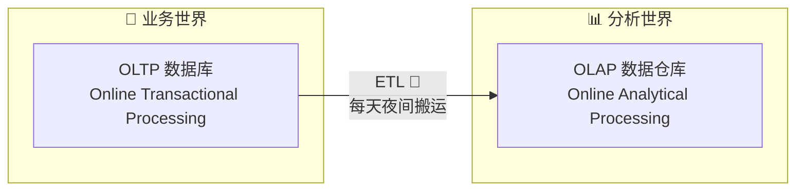

### 对比表

| 特征 | OLTP（业务库） | OLAP（数据仓库） |
|------|---------------|------------------|
| **中文名** | 联机事务处理 | 联机分析处理 |
| **目的** | 跑业务（收银、下单） | 做分析（报表、决策） |
| **操作类型** | CRUD（增删改查） | 几乎只有"查"（SELECT） |
| **单次操作数据量** | 几行到几十行 | 百万到亿级别 |
| **数据时效** | 当前、实时 | 历史、快照 |
| **数据粒度** | 明细（每一笔交易） | 汇总+明细 |
| **用户数量** | 成千上万 | 几十到几百 |
| **规范化** | 高度规范化（3NF） | 反规范化（便于查询） |
| **举例** | 淘宝下单、银行转账 | 年度销售报表、客户画像 |

### 核心矛盾

```
OLTP 要的是 → 写得快、不丢数据、并发高
OLAP 要的是 → 读得快、随心查、维度多
```

**一个数据库无法同时满足两者**，所以必须分开——这就是数据仓库存在的根本原因。

---

## 3. 数据仓库架构全景图

这是整个课程最核心的图，请牢牢记住这个结构：

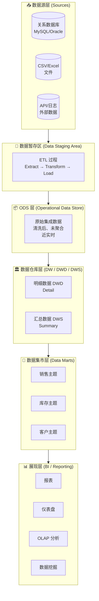

### 各层详解（从下到上）

#### 第 0 层：数据源（Sources）
- 来自各个业务系统：销售系统、仓储系统、财务系统、网站日志...
- **特点**：异构（格式不同）、分散（多个系统）、脏（有错误数据）

#### 第 1 层：数据暂存区（Staging Area）— "码头"
- ETL 的"E"（提取）在这里发生
- 把源数据原样拉过来，**不做任何修改**
- 一个临时中转站

#### 第 2 层：ODS（Operational Data Store）— "整合层"
- ETL 的"T"（转换）完成后存入
- 数据已经：**清洗**（去掉脏数据）、**统一格式**（日期格式统一）、**去重**
- 保留了业务级别的明细
- **特点**：贴源、近实时、可追溯

#### 第 3 层：数据仓库层（DW）— "核心层"
- 进一步拆分：
  - **DWD** (Data Warehouse Detail)：明细宽表，按主题组织（如：订单明细宽表）
  - **DWS** (Data Warehouse Summary)：汇总表，预聚合（如：每日销售汇总）
- 数据已**面向主题**组织，不是面向业务过程

#### 第 4 层：数据集市（Data Mart）— "专柜"
- 从 DW 中抽取**特定主题**的数据
- 按部门/业务线定制（销售部只看销售数据）
- 粒度更粗，直接服务于报表

#### 第 5 层：展现层（BI）— "橱窗"
- 用户直接看到的：仪表盘、报表、自助分析
- 工具如 Power BI、Tableau、SSRS 等

---

## 4. 两大流派：Inmon vs Kimball

这两位是数据仓库领域的"孔子与孟子"，理解他们的分歧很重要。

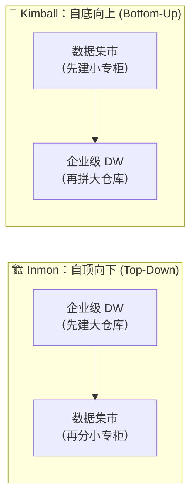

### 对比

| | Inmon（企业工厂） | Kimball（集市联盟） |
|---|---|---|
| **比喻** | 先建大型中央仓库，再分拨到各门店 | 先在各门店建小仓库，再打通成网络 |
| **起点** | 整个企业的规范化数据模型（3NF） | 某个业务领域的维度模型（星型模式） |
| **数据模型** | 高度规范化（EDW 用 3NF） | 维度建模（星型/雪花） |
| **优点** | 一致性强，全局统一 | 快速交付，业务价值立即可见 |
| **缺点** | 建设周期长，前期投入大 | 各集市可能不一致，整合成本高 |
| **适合** | 大型企业，数据治理要求高 | 敏捷团队，快速迭代 |

### 现在的主流实践

> 现代数据仓库实践中，**Kimball 的维度建模思想**被广泛采用，但架构上倾向于**"混合"路线**：先建一个轻量的 ODS 统一入口，再按 Kimball 方式构建各层。

---

## 5. 维度建模：星型/雪花/星座模式

这是数据仓库**最核心的建模技术**，也是数据分析师必须掌握的。

### 5.1 核心概念：事实表 vs 维度表

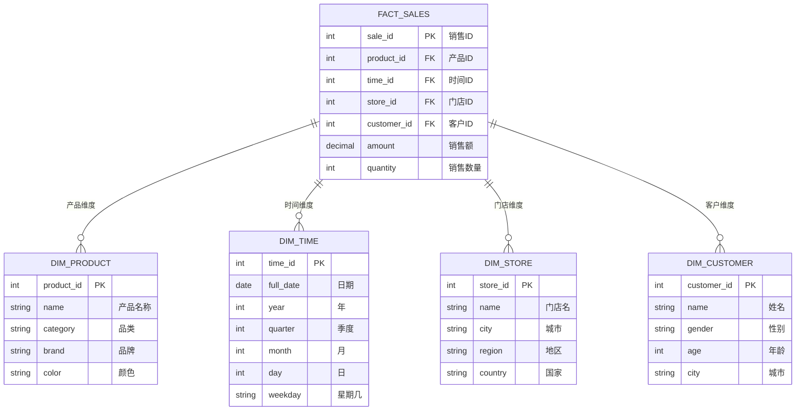

**事实表 (Fact Table)**：
- 存储"发生了什么"——业务度量值
- 特点是**数字、可加总**（金额、数量）
- 快速增长（每天百万行）
- 包含多个外键指向维度表

**维度表 (Dimension Table)**：
- 存储"从什么角度分析"——分析视角
- 特点是**描述性文字**（名称、类别、城市）
- 增长缓慢（产品种类就那么多）
- 主键被事实表引用

### 5.2 生活中的类比：Excel 透视表

```
透视表的"值"区域    → 事实（数字指标）
透视表的"行/列"区域  → 维度（分析角度）
透视表的"筛选"区域   → 也是维度
```

你在 Excel 里拖拽"城市"到行标签，"月份"到列标签，"销售额"到值区域——这就是一个**手工的数据仓库查询**！

### 5.3 星型模式 (Star Schema)

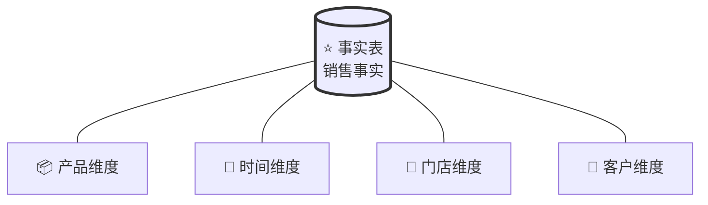

- **一张事实表**在中间
- **多张维度表**直接围绕事实表
- 维度表之间**不关联**
- **优点**：查询简单、JOIN 少、性能好
- **缺点**：维度表有冗余（如"城市→省→国家"重复存储）

### 5.4 雪花模式 (Snowflake Schema)

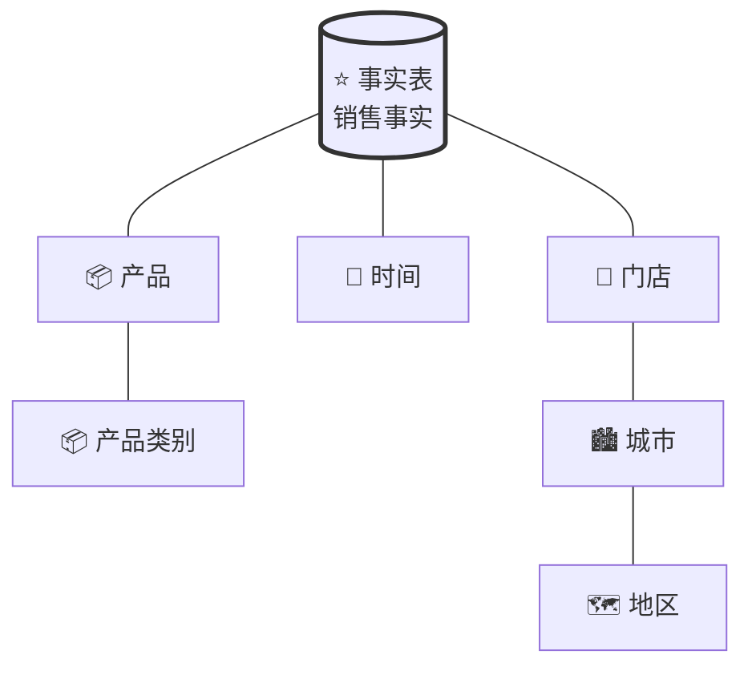

- 维度表被**进一步规范化**，拆成多级
- 形状像雪花的分叉
- **优点**：减少冗余，节省存储
- **缺点**：JOIN 更多，查询变慢（通常不推荐用于数据仓库）

### 5.5 星座模式 (Constellation / Galaxy)

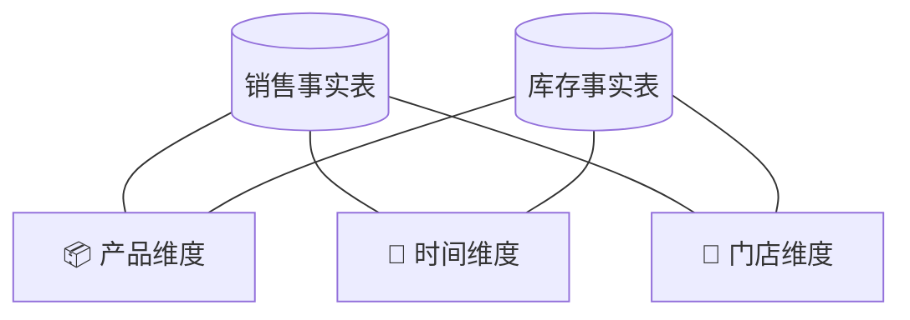

- **多张事实表**共享维度表
- 这是真实数据仓库中**最常见**的模式
- 销售事实和库存事实都用到"产品"和"时间"维度

### 5.6 建模选择指南

| 模式 | 什么时候用 |
|------|-----------|
| 星型 ★ | 中小规模，追求查询速度（最常用） |
| 雪花 ❄ | 维度层级很深且变化频繁，存储紧张 |
| 星座 ✦ | 多个业务过程需要分析，真实项目标配 |

---

## 6. OLAP 多维分析操作

OLAP 的核心就是**在多维空间里"切"数据**。想象一个三维魔方：

```
       时间 →
    ┌──────────────┐
产  │ ■  ■  ■  ■  │
品  │ ■  ■  ■  ■  │
↓  │ ■  ■  ■  ■  │
    └──────────────┘
       门店 →
```

### 6.1 五大经典操作

```mermaid
graph TB
    subgraph drill["🔽 Drill-Down（下钻）"]
        D1["年 → 季度 → 月 → 日"]
        D2["国家 → 省 → 市 → 区"]
        D3["越来越细，看到细节"]
    end
    
    subgraph rollup["🔼 Roll-Up（上卷）"]
        R1["日 → 月 → 季度 → 年"]
        R2["区 → 市 → 省 → 国家"]
        R3["越来越粗，看整体趋势"]
    end
    
    subgraph slice["🔪 Slice（切片）"]
        SL1["固定一个维度=某个值"]
        SL2["只看"2024年"的数据"]
        SL3["降维：三维 → 二维"]
    end
    
    subgraph dice["🎲 Dice（切块）"]
        DC1["固定多个维度的范围"]
        DC2["2024年 + 华东区 + 电子产品"]
        DC3["形成数据子立方"]
    end
    
    subgraph pivot["🔄 Pivot（旋转）"]
        PV1["交换行列维度"]
        PV2["把"产品×时间"变成"时间×产品""]
        PV3["换个角度看同一数据"]
    end
```

### 6.2 具体例子

```sql
-- 原始查询：2024年各产品的销售总额
SELECT product, SUM(amount) 
FROM sales 
WHERE year = 2024
GROUP BY product;

-- Drill-Down（下钻）：展开到月度
SELECT product, month, SUM(amount) 
FROM sales 
WHERE year = 2024
GROUP BY product, month;

-- Roll-Up（上卷）：不看产品，只看品类
SELECT category, SUM(amount) 
FROM sales 
WHERE year = 2024
GROUP BY category;

-- Slice（切片）：只看"北京"的数据
SELECT product, month, SUM(amount) 
FROM sales 
WHERE year = 2024 AND city = '北京'
GROUP BY product, month;

-- Dice（切块）：多条件约束
SELECT product, month, SUM(amount) 
FROM sales 
WHERE year = 2024 
  AND region = '华东'
  AND category IN ('电子','家居')
GROUP BY product, month;
```

> **记忆口诀**：Drill-Down看细节，Roll-Up看全局，Slice切一片，Dice切一块，Pivot换个姿势再看。

---

## 7. 三类 OLAP 架构：ROLAP / MOLAP / HOLAP

OLAP 有不同的"物理实现方式"，就像你可以把数据存在硬盘、内存、或者两者结合。

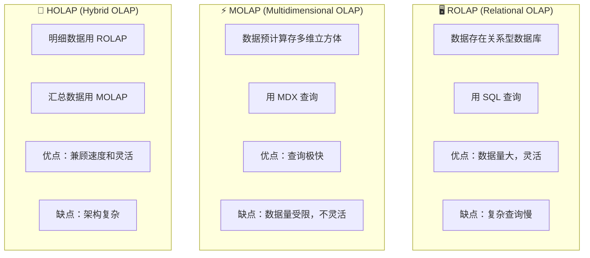

### 对比

| | ROLAP | MOLAP | HOLAP |
|---|---|---|---|
| **存储** | 关系表 | 多维立方体 | 两者混合 |
| **查询语言** | SQL | MDX | SQL + MDX |
| **速度** | 慢（实时算） | 快（预计算） | 中等 |
| **数据量** | 海量 | GB~TB | 海量 |
| **灵活性** | 高 | 低 | 中 |
| **代表产品** | 任何 SQL 数据库 | SSAS, Essbase | SSAS (混合模式) |

### 实际场景

- **ROLAP**：你需要灵活的自定义分析，数据量特别大（如淘宝用户行为分析）
- **MOLAP**：你的报表固定，需要秒级响应（如高管仪表盘）
- **HOLAP**：你既要固定报表的快速响应，又要偶尔的明细查询

---

## 8. SQL 分析实战

这部分直接对应你的 `06SQLAnalytics2022V01.pdf` 和 `07RepotingSQLv03.pdf` 教材。

### 8.1 数据仓库常用 SQL 模式

```sql
-- ========== 1. 基础聚合（最常用）==========
-- 按产品统计销售额
SELECT 
    p.name AS 产品名,
    SUM(f.amount) AS 总销售额,
    COUNT(DISTINCT f.customer_id) AS 购买人数
FROM fact_sales f
JOIN dim_product p ON f.product_id = p.product_id
WHERE f.year = 2024
GROUP BY p.name
ORDER BY 总销售额 DESC;

-- ========== 2. 同比/环比分析 ==========
-- 每月销售额及同比
SELECT 
    t.year,
    t.month,
    SUM(f.amount) AS 本月销售额,
    LAG(SUM(f.amount)) OVER (ORDER BY t.year, t.month) AS 上月销售额,
    ROUND((SUM(f.amount) - LAG(SUM(f.amount)) OVER (ORDER BY t.year, t.month)) 
          / LAG(SUM(f.amount)) OVER (ORDER BY t.year, t.month) * 100, 2) AS 环比增长率
FROM fact_sales f
JOIN dim_time t ON f.time_id = t.time_id
GROUP BY t.year, t.month
ORDER BY t.year, t.month;

-- ========== 3. 排名分析 ==========
-- 每个城市销售额排名
SELECT 
    s.city AS 城市,
    SUM(f.amount) AS 销售额,
    RANK() OVER (ORDER BY SUM(f.amount) DESC) AS 排名
FROM fact_sales f
JOIN dim_store s ON f.store_id = s.store_id
GROUP BY s.city;

-- ========== 4. 累计汇总 (Running Total) ==========
SELECT 
    t.month,
    SUM(f.amount) AS 月销售额,
    SUM(SUM(f.amount)) OVER (ORDER BY t.month) AS 累计销售额
FROM fact_sales f
JOIN dim_time t ON f.time_id = t.time_id
WHERE t.year = 2024
GROUP BY t.month;

-- ========== 5. 占比分析 ==========
SELECT 
    p.category AS 品类,
    SUM(f.amount) AS 销售额,
    ROUND(SUM(f.amount) / SUM(SUM(f.amount)) OVER () * 100, 2) AS 占比百分比
FROM fact_sales f
JOIN dim_product p ON f.product_id = p.product_id
GROUP BY p.category;

-- ========== 6. GROUPING SETS（多维聚合一次搞定）==========
SELECT 
    p.category,
    s.region,
    t.year,
    SUM(f.amount) AS 销售额
FROM fact_sales f
JOIN dim_product p ON f.product_id = p.product_id
JOIN dim_store s ON f.store_id = s.store_id
JOIN dim_time t ON f.time_id = t.time_id
GROUP BY GROUPING SETS (
    (p.category),           -- 只按品类
    (s.region),             -- 只按地区
    (t.year),               -- 只按年份
    (p.category, s.region), -- 品类+地区
    ()                      -- 总计
);

-- ========== 7. CUBE（所有组合）==========
-- 等同于所有可能的 GROUPING SETS 组合
SELECT 
    p.category,
    s.region,
    SUM(f.amount) AS 销售额
FROM fact_sales f
JOIN dim_product p ON f.product_id = p.product_id
JOIN dim_store s ON f.store_id = s.store_id
GROUP BY CUBE(p.category, s.region);
-- 生成：()、(品类)、(地区)、(品类+地区) 四种聚合

-- ========== 8. ROLLUP（层级上卷）==========
SELECT 
    t.year,
    t.quarter,
    t.month,
    SUM(f.amount) AS 销售额
FROM fact_sales f
JOIN dim_time t ON f.time_id = t.time_id
GROUP BY ROLLUP(t.year, t.quarter, t.month);
-- 生成：(年月日)、(年季)、（年）、总计
```

### 8.2 窗口函数速查表

| 函数 | 作用 | 典型场景 |
|------|------|---------|
| `ROW_NUMBER()` | 行号 | 去重保留一条 |
| `RANK()` | 排名（有间隔） | "第1、第2、第2、第4..." |
| `DENSE_RANK()` | 排名（无间隔） | "第1、第2、第2、第3..." |
| `LAG(col, n)` | 前 n 行 | 环比、同比 |
| `LEAD(col, n)` | 后 n 行 | 预测对比 |
| `SUM() OVER (ORDER BY)` | 累计求和 | 累计销售额 |
| `SUM() OVER (PARTITION BY)` | 分组求和 | 各部门占比 |

---

## 9. MDX 多维表达式简介

MDX（Multidimensional Expressions）是查询 **OLAP 立方体**的语言，不同于 SQL。

### SQL vs MDX 思维对比

| | SQL（关系模型） | MDX（多维模型） |
|---|---|---|
| 查询对象 | 表（行×列） | 立方体（维度×维度×度量） |
| 操作 | `SELECT ... FROM ... WHERE` | `SELECT ... ON COLUMNS, ... ON ROWS FROM ... WHERE` |
| 输出 | 二维表格 | 多维数据集 |
| 典型查询 | "列出2024年销售额" | "在列上放时间，在行上放产品，显示销售额" |

### 基本 MDX 语法

```mdx
-- MDX 基本结构
SELECT
    { [Measures].[销售额], [Measures].[数量] } ON COLUMNS,  -- 列轴：度量
    { [Product].[Category].MEMBERS } ON ROWS                -- 行轴：维度成员
FROM [SalesCube]                                            -- 立方体名
WHERE ( [Time].[2024], [Store].[北京] )                     -- 切片条件
```

### MDX 常用函数

```mdx
-- 子成员
[Time].[2024].CHILDREN          -- 2024的4个季度

-- 后代（所有层级）
DESCENDANTS([Time].[2024])      -- 2024的所有子层级

-- 同级
[Product].[电子].SIBLINGS       -- 所有品类

-- 父级
[Store].[朝阳区].PARENT         -- 北京市

-- 聚合
AGGREGATE({[Time].[Q1], [Time].[Q2]})  -- Q1+Q2 合计
```

> **一句话理解**：SQL 问"给我某几列的数据"，MDX 问"在列轴上放这个，行轴上放那个，给我看这个指标"。

---

## 10. ETL：数据的"搬运工"

ETL 是数据仓库的"心脏"，没有它，数据仓库就是一栋空楼。

### ETL 三阶段

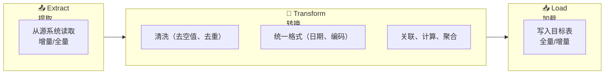

### 提取（Extract）

- **全量提取**：每次都拉全部数据（简单但慢）
- **增量提取**：只拉新/变更的数据（快但需要跟踪变更）
- **CDC (Change Data Capture)**：数据库日志级增量，最优雅

### 转换（Transform）

| 操作 | 例子 |
|------|------|
| 清洗 | `NULL` → `"未知"`, 去重 |
| 统一 | `2024/01/01` → `2024-01-01`, `$1,000` → `1000.00` |
| 拆分 | `"张三，北京"` → `name="张三", city="北京"` |
| 合并 | `first_name + last_name` → `full_name` |
| 派生 | `出生日期` → `年龄 = DATEDIFF(year, 出生日期, GETDATE())` |
| 聚合 | 明细 → 按日汇总 |

### 加载（Load）

- **全量加载**：清空目标表，重新插入（简单但不可追溯）
- **增量加载**：只插入新数据
- **Upsert (Merge)**：有则更新，无则插入

### ETL vs ELT（现代趋势）

```
传统 ETL：源 → 转换 → 仓库      （先处理再入库，ETL 服务器有压力）
现代 ELT：源 → 仓库 → 转换      （先入库再用数仓算力处理，更灵活）
```

> 云数仓时代（Snowflake、BigQuery），**ELT 成为主流**：先把原始数据全部拉进来，再用数仓强大的计算能力去转换。

---

## 11. Data Mart 数据集市

### 什么是 Data Mart

数据仓库是**全公司的数据集合**，数据集市是**某个部门的数据子集**。

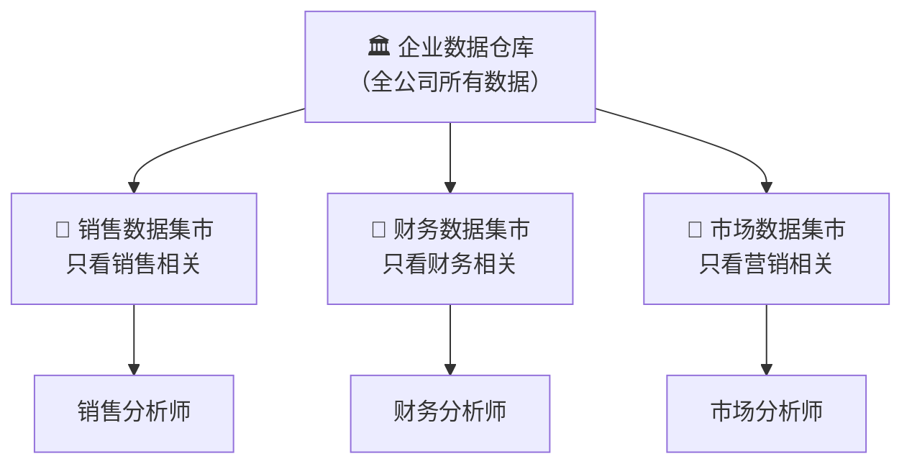

### 三种类型

| 类型 | 说明 | 例子 |
|------|------|------|
| **依赖型 Data Mart** | 从 EDW 派生 | 从公司数仓抽取销售数据 |
| **独立型 Data Mart** | 直接从源系统构建 | 小团队自己建的分析库 |
| **混合型 Data Mart** | 部分来自 EDW + 部分来自外部 | 内部销售数据 + 外部市场数据 |

---

## 12. 学习路径建议

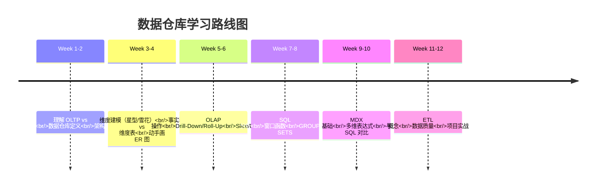

### 推荐阅读顺序

1. 先读完这份指南，建立全局认知
2. 看教材 `01IntroEdD2025-26ZUSTv01.pdf` 巩固基础概念
3. 看教材 `02ArchitectureDW2025-26ZUSTv01.pdf` 理解架构
4. 看教材 `04OLAP2025-26ZUSTv01.pdf` 学 OLAP 操作
5. 看教材 `06SQLAnalytics2022V01.pdf` 写 SQL
6. 看教材 `05MDXetOLAP2024_25v01.pdf` 学 MDX
7. 看教材 `07RepotingSQLv03.pdf` 学报表
8. 用 `ProjetDW2025-26ZUSTV01.pdf` 和 `TD_MDX_ZUST.pdf` 做练习

### 必读书籍

| 书籍 | 说明 |
|------|------|
| Kimball《The Data Warehouse Toolkit》 | 维度建模圣经，必读 |
| Inmon《Building the Data Warehouse》 | 企业级数仓方法论 |
| Inmon《DW 2.0》 | 了解大数据和云时代的数仓演进 |

---

## 附录：概念速查表

| 英文缩写 | 全称 | 中文 | 一句话解释 |
|----------|------|------|-----------|
| **DW / EDW** | Data Warehouse / Enterprise DW | 数据仓库 | 专门做分析用的数据库 |
| **OLTP** | Online Transactional Processing | 联机事务处理 | 跑业务的数据库（收银系统） |
| **OLAP** | Online Analytical Processing | 联机分析处理 | 做分析的数据库（报表系统） |
| **ETL** | Extract, Transform, Load | 提取转换加载 | 把数据从业务库搬到数仓的管道 |
| **ODS** | Operational Data Store | 操作数据存储 | 数据刚搬进来、清洗后的"中转站" |
| **DWD** | Data Warehouse Detail | 明细数据层 | 数仓里的明细宽表 |
| **DWS** | Data Warehouse Summary | 汇总数据层 | 数仓里的预汇总表 |
| **Data Mart** | Data Mart | 数据集市 | 按部门/主题分割的小仓库 |
| **MDX** | Multidimensional Expressions | 多维表达式 | 查询 OLAP 立方体的语言 |
| **ROLAP** | Relational OLAP | 关系型 OLAP | 用 SQL 查关系表做 OLAP |
| **MOLAP** | Multidimensional OLAP | 多维 OLAP | 用预计算立方体做 OLAP |
| **HOLAP** | Hybrid OLAP | 混合 OLAP | ROLAP + MOLAP 混用 |
| **CDC** | Change Data Capture | 变更数据捕获 | 只抓数据变化部分的高效 ETL |
| **3NF** | Third Normal Form | 第三范式 | OLTP 的规范化设计（消除冗余） |

---

> 📝 这份指南会持续更新，建议结合教材和练习反复回顾。数据仓库是一门"做中学"的学科，动手写 SQL、画模型图，远比光看理论有效。
