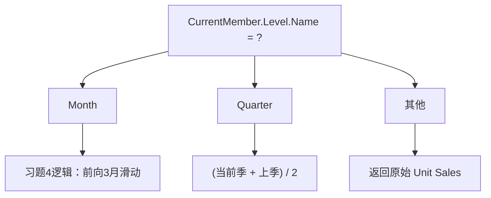

# TD_MDX 完全解析 —— Mondrian 分层语法版

> **环境**：Mondrian OLAP Engine | FoodMart Sales Cube
> **维度结构**：`[Time]` (Year → Quarter → Month) | `[Store]` (Country → State → City) | `[Product]` (Family → Department → Category)
> **度量**：`[Measures].[Unit Sales]`

---

## 习题 1：基础交叉表 —— 时间三层钻取

**题目**：查询1997年Sales，展示 Month / Quarter / Year 三个层级。

```
          Jan  Feb  Mar  Apr  May  Jun  Jul  Aug  Sep  Oct  Nov  Dec
Month      x    x    x    x    x    x    x    x    x    x    x    x
Quarter    x    x    x    x    x    x    x    x    x    x    x    x
Year       x    x    x    x    x    x    x    x    x    x    x    x
```

### 数据分析师思路

核心挑战：**同一维度出现在行列两轴时，Mondrian的自动存在（auto-exists）会让高层级成员被底层级覆盖**——也就是说 `[Q1]` 行 × `[Jan]` 列时，Mondrian 取的是 `[Jan]` 的值而非 `[Q1]` 的季度汇总。

解决方案：**不把层级成员直接放行轴，而是通过计算成员 + `Ancestor()` 上溯到目标层级取值**。这样行轴上是三个独立的"度量视角"：月粒度原值、季度汇总、年度汇总。

### 解决方案

```mdx
WITH
-- 度量1：月份粒度的原始值（就是销售本身）
MEMBER [Measures].[Valeur Mois] AS
    [Measures].[Unit Sales]

-- 度量2：当前月份所属季度的汇总值
MEMBER [Measures].[Valeur Trimestre] AS
    (
        [Measures].[Unit Sales],
        Ancestor([Time].CurrentMember, [Time].[Quarter])
    )

-- 度量3：当前月份所属年度的汇总值
MEMBER [Measures].[Valeur Annee] AS
    (
        [Measures].[Unit Sales],
        Ancestor([Time].CurrentMember, [Time].[Year])
    )

SELECT
    -- 列轴：1997年所有月份
    Descendants([Time].[1997], [Time].[Month]) ON COLUMNS,
    
    -- 行轴：三个度量视角
    {
        [Measures].[Valeur Mois],
        [Measures].[Valeur Trimestre],
        [Measures].[Valeur Annee]
    } ON ROWS
    
FROM [Sales]
```

### 关键点剖析

| 步骤 | 作用 |
|------|------|
| `Descendants([Time].[1997], [Time].[Month])` | 从1997节点出发，下钻到 Month 层级取所有后代，得到 Jan~Dec |
| `Ancestor([Time].CurrentMember, [Time].[Quarter])` | 在列轴的月份上下文里，向上追溯到 Quarter 层级，拿到该月所属季度成员 |
| 元组 `(Measure, Member)` | 在祖先成员的上下文中重新计算度量值，实现"以季度粒度显示"的效果 |
| 三度量并列 ON ROWS | 用度量轴模拟行轴分层，绕开同维度冲突 |

**为什么不用直接放成员**：如果写成 `{[Time].[1997].Children, [Time].[1997]} ON ROWS`，当列轴是 Month 时，Mondrian 的 auto-exists 会让 Quarter 行和 Year 行的每个单元格都按 Month 粒度计算，不是我们想要的季度/年度汇总。

---

## 习题 2：带 State 过滤与双维度交叉表

**题目**：精确查询 CA 和 WA 在 1997 年 Q1~Q4 的 Sales，含行列小计。

```
             Q1    Q2    Q3    Q4    T_State
CA            x     x     x     x       x
WA            x     x     x     x       x
T_Quarter     x     x     x     x       x
```

### 数据分析师思路

这是经典的 **2维交叉表 + 边缘小计**。在Mondrian中：

- 筛选 State：用 `Filter()` 按名称精确匹配 CA 和 WA
- 列小计 T_Quarter：`WITH MEMBER` 挂到 Time 维度，用 `Aggregate()` 汇总四个季度
- 行小计 T_State：`WITH MEMBER` 挂到 Store 维度，汇总两个州

**关键**：小计不挂到 Measures 维度，而是挂到各自的维度下，这样才能在行列交叉时参与自动聚合。

### 解决方案

```mdx
WITH
-- 行计算成员：州总计
MEMBER [Store].[T_State] AS
    Aggregate(
        Filter(
            [Store].[Store State].Members,
            [Store].CurrentMember.Name = "CA"
            OR [Store].CurrentMember.Name = "WA"
        )
    )

-- 列计算成员：季度总计
MEMBER [Time].[T_Quarter] AS
    Aggregate(
        Descendants([Time].[1997], [Time].[Quarter])
    )

-- 筛选出的州集合
SET [Deux Etats] AS
    Filter(
        [Store].[Store State].Members,
        [Store].CurrentMember.Name = "CA"
        OR [Store].CurrentMember.Name = "WA"
    )

SELECT
    {
        Descendants([Time].[1997], [Time].[Quarter]),
        [Time].[T_Quarter]
    } ON COLUMNS,
    
    {
        [Deux Etats],
        [Store].[T_State]
    } ON ROWS
    
FROM [Sales]
WHERE ([Measures].[Unit Sales])
```

### 更简洁的写法（已知成员名）

如果确定 CA/WA 在 Store 维度下存在且命名固定：

```mdx
WITH
MEMBER [Store].[T_State] AS
    Aggregate({[Store].[CA], [Store].[WA]})

MEMBER [Time].[T_Quarter] AS
    Aggregate(Descendants([Time].[1997], [Time].[Quarter]))

SELECT
    {
        Descendants([Time].[1997], [Time].[Quarter]),
        [Time].[T_Quarter]
    } ON COLUMNS,
    {
        [Store].[CA],
        [Store].[WA],
        [Store].[T_State]
    } ON ROWS
FROM [Sales]
WHERE ([Measures].[Unit Sales])
```

### 关键点剖析

| 概念 | Mondrian行为 |
|------|-------------|
| `Filter(set, condition)` | 遍历集合中每个成员，仅保留满足条件的；`CurrentMember` 在 Filter 内部指向被遍历的成员 |
| `[Store].[Store State].Members` | 获取 Store 维度中 Store State 层级的所有成员（所有州） |
| `Aggregate()` | 智能聚合：对普通度量做 SUM，对半累加度量做正确的聚合（比 SUM 更健壮） |
| 小计挂到维度 | `[Store].[T_State]` 而非 `[Measures].[T_State]`：挂到维度下才能在后续交叉中正常参与运算 |

---

## 习题 3：三层嵌套交叉表 —— Product × Time

**题目**：Drink / Food 产品族 → 各自部门 → 小计 × Q1 / Q2 → 各月 → 小计，含行列总计。

```
Sales 1997      Q1                  Q2                T_Prod
                Jan  Feb  Mar  ST   Apr  May  Jun  ST
Drink
  Alcoholic      x    x    x   x     x    x    x   x     x
  Beverages      x    x    x   x     x    x    x   x     x
  Sub_T1         x    x    x   x     x    x    x   x     x
Food
  Baked goods    x    x    x   x     x    x    x   x     x
  ...            x    x    x   x     x    x    x   x     x
  Sub_T1         x    x    x   x     x    x    x   x     x
T_Time Total     x    x    x   x     x    x    x   x     x
```

### 数据分析师思路

三层嵌套的本质是**两个维度分别在行列轴上展开，且各自内部带层级小计**。

Mondrian 中构建这种报表的策略：

1. **行轴**：枚举 Drinks 下所有部门 + Drinks小计 → Food 下所有部门 + Food小计 → 行总计
2. **列轴**：枚举 Q1 下月份 + Q1小计 → Q2 下月份 + Q2小计 → 列表总计
3. 小计用 `WITH MEMBER` 挂到**对应父成员下**（如 `[Product].[Drink].[Sub_T1]`），确保层级正确

**为什么不直接用 CrossJoin**：Mondrian 对同维度嵌套 CrossJoin 支持有限，手动枚举集合更可控。

### 解决方案

```mdx
WITH
-- ============ 行侧：产品维度的小计 ============
-- Drinks 部门小计
MEMBER [Product].[Drink].[Sub_T1] AS
    Aggregate([Product].[Drink].Children)

-- Food 部门小计
MEMBER [Product].[Food].[Sub_T1] AS
    Aggregate([Product].[Food].Children)

-- 产品维度行总计
MEMBER [Product].[T_Prod] AS
    Aggregate({[Product].[Drink], [Product].[Food]})

-- ============ 列侧：时间维度的小计 ============
-- Q1 月份小计
MEMBER [Time].[1997].[Q1].[Sub_T] AS
    Aggregate([Time].[1997].[Q1].Children)

-- Q2 月份小计
MEMBER [Time].[1997].[Q2].[Sub_T] AS
    Aggregate([Time].[1997].[Q2].Children)

-- ============ 最终列总计 ============
MEMBER [Time].[T_Time_Total] AS
    Aggregate({[Time].[1997].[Q1], [Time].[1997].[Q2]})

SELECT
    -- 列轴：Q1月份 + Q1小计 + Q2月份 + Q2小计 + 总总计
    {
        [Time].[1997].[Q1],
        [Time].[1997].[Q1].Children,     -- Jan, Feb, Mar
        [Time].[1997].[Q1].[Sub_T],       -- Q1小计
        
        [Time].[1997].[Q2],
        [Time].[1997].[Q2].Children,     -- Apr, May, Jun
        [Time].[1997].[Q2].[Sub_T],       -- Q2小计
        
        [Time].[T_Time_Total]             -- 全部总计
    } ON COLUMNS,
    
    -- 行轴：Drinks系列 + Food系列 + 行总计
    {
        [Product].[Drink],
        [Product].[Drink].Children,       -- Alcoholic, Beverages, Dairy...
        [Product].[Drink].[Sub_T1],        -- Drinks小计
        
        [Product].[Food],
        [Product].[Food].Children,        -- Baked Goods, Canned...
        [Product].[Food].[Sub_T1],         -- Food小计
        
        [Product].[T_Prod]                -- 行总计
    } ON ROWS
    
FROM [Sales]
WHERE ([Measures].[Unit Sales])
```

### 关键点剖析

| 概念 | 说明 |
|------|------|
| `.Children` | 返回某成员的**直接子成员**；`[Product].[Drink].Children` = {Alcoholic, Beverages, Dairy...} |
| 小计挂到父成员下 | `[Product].[Drink].[Sub_T1]` 是 `[Drink]` 的子成员，在层次结构中逻辑合理 |
| 手动枚举顺序 | 父母 → 子 → 小计 → 下一个父母 → ... 严格控制输出顺序 |
| `Aggregate()` | 确保半累加度量也能正确汇总 |

---

## 习题 4：月度移动平均（前2月窗口）

**题目**：创建计算度量 `Moyen Mobile`：
- 第1个月（Jan）→ 等于当月值本身
- 第2个月（Feb）→ (Jan + Feb) / 2
- 第3个月起 → (当月 + 前1月 + 前2月) / 3

### 数据分析师思路

本质是**时间序列滑动窗口**，Mondrian 提供了天然的时间导航函数：

- `.PrevMember`：同层级上一个成员（Jan 的 PrevMember 为 NULL）
- `.CurrentMember`：当前上下文中该维度的成员
- `.Level.Name`：判断当前所在层级

边界判断策略：
- Jan：`PrevMember IS NULL` → 自身
- Feb：`PrevMember.PrevMember IS NULL` → 前2月平均
- 其他：三个成员取平均

**注意**：元组 `(Measure, Member)` 的括号写法在 Mondrian 中是标准语法，用于切换上下文。

### 解决方案

```mdx
WITH
MEMBER [Measures].[Moyen Mobile] AS
    IIF(
        -- 防御：非 Month 层级不计算
        [Time].CurrentMember.Level.Name <> "Month",
        NULL,
        
        IIF(
            -- 条件1：第一个月（Jan 没有 PrevMember）
            [Time].CurrentMember.PrevMember IS NULL,
            [Measures].[Unit Sales],
            
            IIF(
                -- 条件2：第二个月（Feb 的 PrevMember.PrevMember 不存在）
                [Time].CurrentMember.PrevMember.PrevMember IS NULL,
                (
                    [Measures].[Unit Sales]
                    + ([Measures].[Unit Sales],
                       [Time].CurrentMember.PrevMember)
                ) / 2,
                
                -- 条件3：通用情况（三个月的平均值）
                (
                    [Measures].[Unit Sales]
                    + ([Measures].[Unit Sales],
                       [Time].CurrentMember.PrevMember)
                    + ([Measures].[Unit Sales],
                       [Time].CurrentMember.PrevMember.PrevMember)
                ) / 3
            )
        )
    )

SELECT
    Descendants([Time].[1997], [Time].[Month]) ON COLUMNS,
    {
        [Measures].[Unit Sales],
        [Measures].[Moyen Mobile]
    } ON ROWS
FROM [Sales]
```

### 关键点剖析

| 概念 | 说明 |
|------|------|
| `[Time].CurrentMember.Level.Name` | Mondrian 中获取当前时间成员的层级名称，返回字符串如 `"Month"` |
| `.PrevMember` | 返回同层级中的直接前驱；跨年时从 Dec 的 PrevMember 会是 Nov（同年内），不会跨到上一年 |
| `IS NULL` | Mondrian 判断成员是否为空；Jan 无 PrevMember 时为 NULL |
| 嵌套 `IIF` | 从特殊到一般：先判 Jan → 再判 Feb → 通用3月窗口 |
| 元组括号 | `([Measures].[Unit Sales], [Time].CurrentMember.PrevMember)` 在 PrevMember 上下文中取 Unit Sales |

---

## 习题 5：中心化移动平均

**题目**：创建计算度量 `Moyen Mobile Centré`：
- 第1个月（Jan）→ (Jan + Feb) / 2
- 最后1个月（Dec）→ (Nov + Dec) / 2
- 其他月 → (前1月 + 当月 + 后1月) / 3

### 数据分析师思路

与习题4对称但方向不同——**既向前看也向后看**。新增关键函数 `.NextMember`。

判断逻辑：
- 是第一个月？→ `PrevMember IS NULL` → 用 Current + Next / 2
- 是最后一个月？→ `NextMember IS NULL` → 用 Prev + Current / 2  
- 都不是？→ (Prev + Current + Next) / 3

**业务价值**：中心化移动平均比前向移动平均**没有时间滞后**，能更真实地反映每个月的平滑趋势，常用于季节性分析。

### 解决方案

```mdx
WITH
MEMBER [Measures].[Moyen Mobile Centre] AS
    IIF(
        [Time].CurrentMember.Level.Name <> "Month",
        NULL,
        
        IIF(
            -- 条件1：第一个月（没有上月）
            [Time].CurrentMember.PrevMember IS NULL,
            (
                [Measures].[Unit Sales]
                + ([Measures].[Unit Sales],
                   [Time].CurrentMember.NextMember)
            ) / 2,
            
            IIF(
                -- 条件2：最后一个月（没有下月）
                [Time].CurrentMember.NextMember IS NULL,
                (
                    [Measures].[Unit Sales]
                    + ([Measures].[Unit Sales],
                       [Time].CurrentMember.PrevMember)
                ) / 2,
                
                -- 条件3：通用——前、中、后三个月平均
                (
                    [Measures].[Unit Sales]
                    + ([Measures].[Unit Sales],
                       [Time].CurrentMember.PrevMember)
                    + ([Measures].[Unit Sales],
                       [Time].CurrentMember.NextMember)
                ) / 3
            )
        )
    )

SELECT
    Descendants([Time].[1997], [Time].[Month]) ON COLUMNS,
    {
        [Measures].[Unit Sales],
        [Measures].[Moyen Mobile Centre]
    } ON ROWS
FROM [Sales]
```

### 执行逻辑图解

```
月份:     Jan   Feb   Mar   ...   Nov   Dec
原始值:   100   120   110   ...   140   150
─────────────────────────────────────────────
Jan:     (100+120)/2 = 110        ← 边界：无上月，取当月+下月
Feb:     (100+120+110)/3 = 110    ← 正常：前+中+后
Mar:     (120+110+130)/3 = 120    ← 正常
...
Nov:     (...+...+140+150)/3      ← 正常
Dec:     (140+150)/2 = 145        ← 边界：无下月，取上月+当月
```

### 与习题4的对比

| 维度 | 习题4（前向滑动） | 习题5（中心化滑动） |
|------|-------------------|---------------------|
| 窗口形状 | `[t-2, t-1, t]` | `[t-1, t, t+1]` |
| Jan 处理 | 只看自身 | 看自身+下月 |
| Dec 处理 | 看3个月 | 看自身+上月 |
| 额外函数 | `PrevMember` | `PrevMember` + `NextMember` |
| 时间偏差 | 滞后约1个月 | 无滞后 |

---

## 习题 6：完整移动平均（月 + 季度双层）

**题目**：创建计算度量 `Moyen Mobile Complet`：
- **Month 层级**：同习题4的月度移动平均
- **Quarter 层级**：(当前季度 + 上一季度) / 2

### 数据分析师思路

这是对**同一度量在不同层级做不同计算**的经典需求。在 Mondrian 中用 `Level.Name` 做路由分发。



### 解决方案

```mdx
WITH
MEMBER [Measures].[Moyen Mobile Complet] AS
    IIF(
        -- ========= 分支1：Month 层级 → 习题4逻辑 =========
        [Time].CurrentMember.Level.Name = "Month",
        IIF(
            [Time].CurrentMember.PrevMember IS NULL,
            [Measures].[Unit Sales],
            IIF(
                [Time].CurrentMember.PrevMember.PrevMember IS NULL,
                (
                    [Measures].[Unit Sales]
                    + ([Measures].[Unit Sales],
                       [Time].CurrentMember.PrevMember)
                ) / 2,
                (
                    [Measures].[Unit Sales]
                    + ([Measures].[Unit Sales],
                       [Time].CurrentMember.PrevMember)
                    + ([Measures].[Unit Sales],
                       [Time].CurrentMember.PrevMember.PrevMember)
                ) / 3
            )
        ),
        
        -- ========= 分支2：Quarter 层级 → 2季滑动 =========
        IIF(
            [Time].CurrentMember.Level.Name = "Quarter",
            IIF(
                -- Q1 无上一季度，用自身
                [Time].CurrentMember.PrevMember IS NULL,
                [Measures].[Unit Sales],
                -- Q2~Q4：(当前季 + 上季) / 2
                (
                    [Measures].[Unit Sales]
                    + ([Measures].[Unit Sales],
                       [Time].CurrentMember.PrevMember)
                ) / 2
            ),
            
            -- ========= 分支3：其他层级 → 原值 =========
            [Measures].[Unit Sales]
        )
    )

-- 测试查询：同时展示 Month 和 Quarter 层级的两种移动平均
SELECT
    Hierarchize(
        {
            Descendants([Time].[1997], [Time].[Month]),
            Descendants([Time].[1997], [Time].[Quarter])
        }
    ) ON COLUMNS,
    {
        [Measures].[Unit Sales],
        [Measures].[Moyen Mobile Complet]
    } ON ROWS
FROM [Sales]
```

### 关键点剖析

| 概念 | 说明 |
|------|------|
| `[Time].CurrentMember.Level.Name = "Month"` | 判断当前上下文是否在 Month 层级，返回值是字符串 |
| 嵌套 `IIF` 路由 | 先判断 Month → 再判断 Quarter → 兜底返回原值 |
| `Hierarchize()` | 将无序的成员集合按层级排序：全部 Months → 全部 Quarters，输出才整洁 |
| 季度窗口逻辑 | 仅取 (Q+PrevQ)/2，比月份窗口简单，因为一年只有4个点，3点窗口太宽 |
| 生产意义 | 一个计算成员适配所有层级钻取，OLAP 前端不需要切换度量 |

---

## 六题总览

```
┌──────────────────────────────────────────────────────┐
│  习题1: Descendants + Ancestor 多层次交叉           │
│  习题2: Filter + Aggregate 精准过滤+小计            │
│  习题3: .Children 嵌套 + WITH MEMBER 小计           │
│         ───────────── 分水岭 ─────────────          │
│  习题4: PrevMember + IIF 前向滑动窗口               │
│  习题5: PrevMember + NextMember 中心化窗口           │
│  习题6: Level.Name 路由 + 双层逻辑分发               │
└──────────────────────────────────────────────────────┘
```

## Mondrian 核心函数速查

| 函数 | 签名 | 习题 |
|------|------|------|
| `Descendants(m, level)` | 成员 → 指定层级的所有后代 | 1, 2, 4, 5, 6 |
| `Ancestor(m, level)` | 成员 → 指定层级的祖先 | 1 |
| `.Children` | 成员 → 直接子成员集合 | 3 |
| `.PrevMember` | 成员 → 同层级前一个成员 | 4, 5, 6 |
| `.NextMember` | 成员 → 同层级后一个成员 | 5 |
| `.CurrentMember` | 返回当前上下文中该维度的成员 | 4, 5, 6 |
| `.Level.Name` | 返回当前成员所在层级名称 | 4, 5, 6 |
| `Filter(set, cond)` | 按条件筛选集合 | 2 |
| `Aggregate(set)` | 智能聚合（含半累加度量支持） | 2, 3 |
| `IIF(cond, t, f)` | 三元条件分支 | 4, 5, 6 |
| `Hierarchize(set)` | 按维度层级排序 | 6 |
